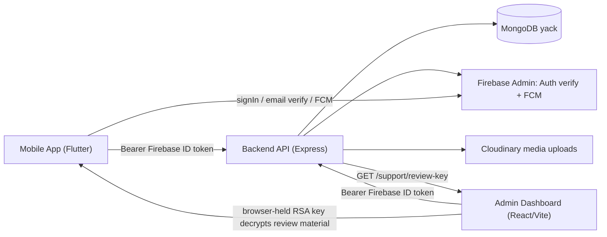
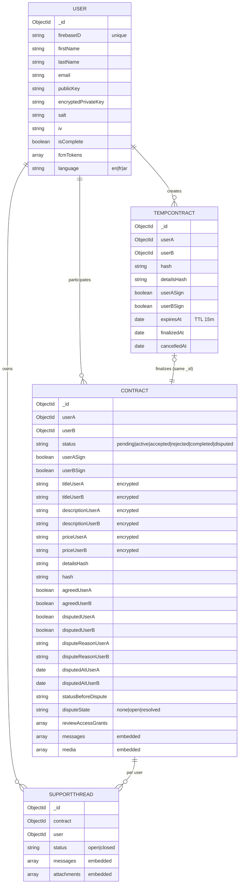
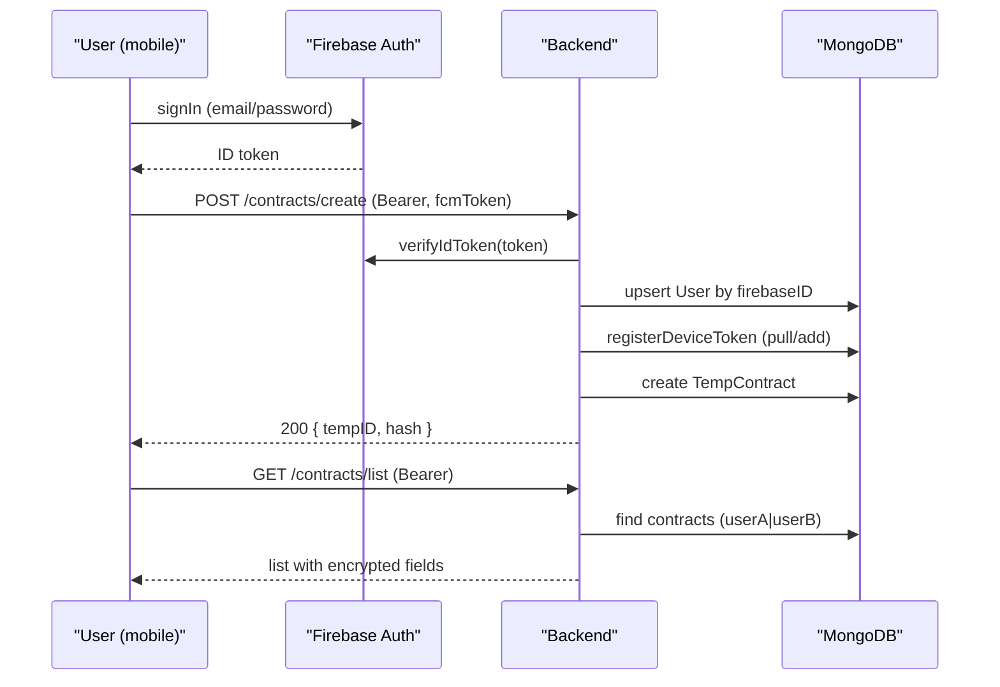
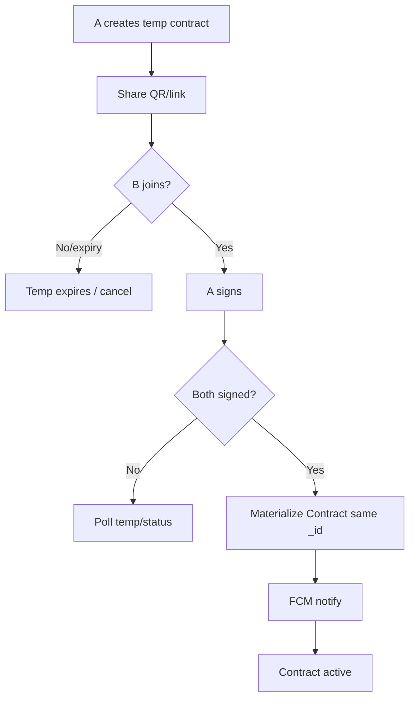
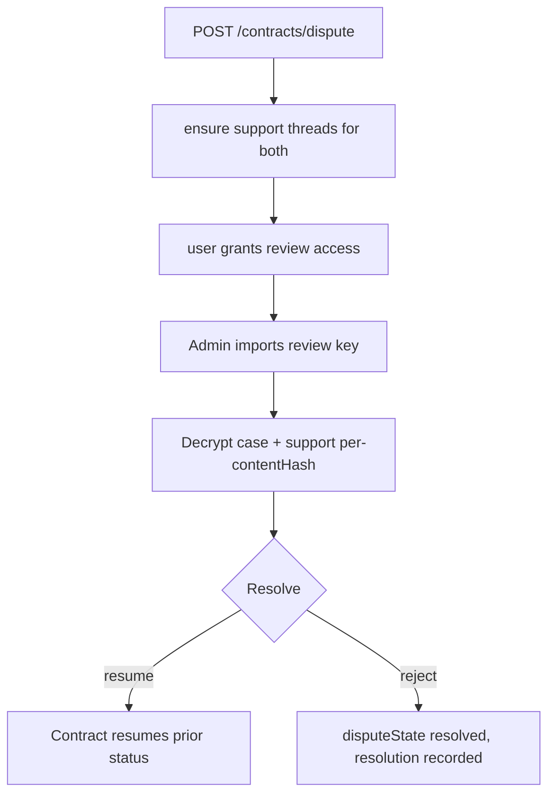
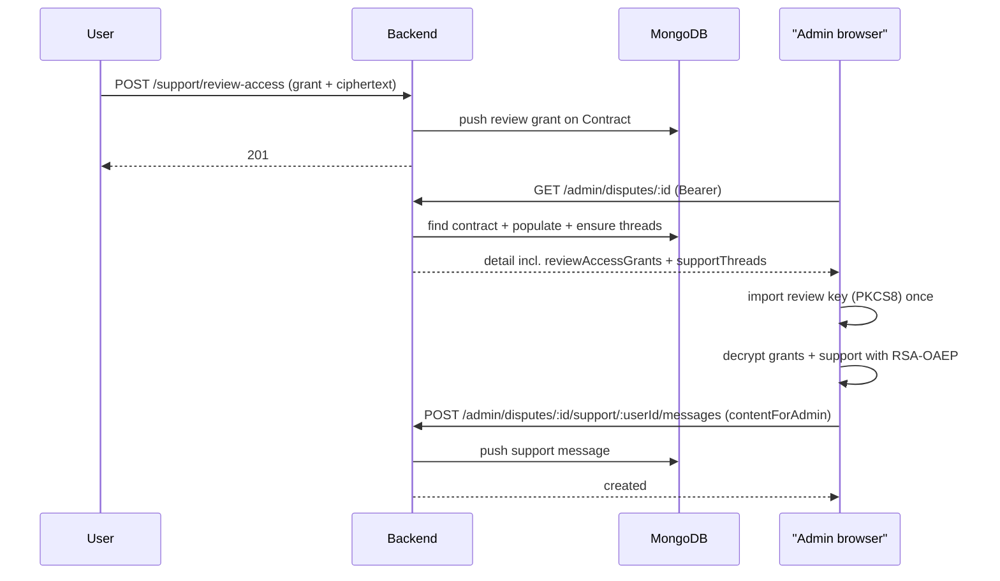
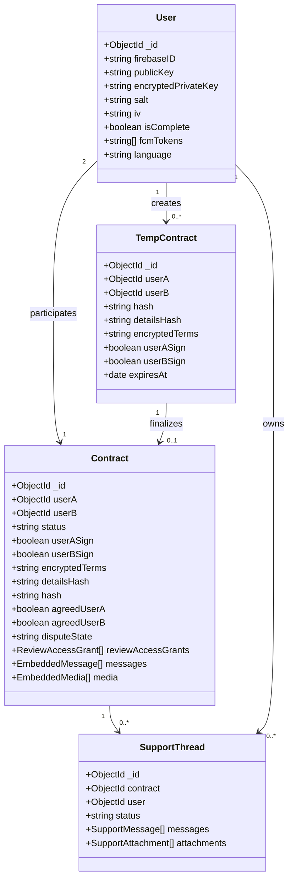

# System Documentation

Reconstructed from the working code of three repositories:

- **YACK** (Flutter mobile app, `develop`) — `C:\Users\moham\Desktop\Projects\YACK`
- **YACK-Backend** (Node/Express + Mongoose, `main`) — `C:\Users\moham\Desktop\Projects\YACK-Backend`
- **YACK-Admin** (React/Vite admin panel, `master`) — `C:\Users\moham\Desktop\Projects\YACK-Admin`

This document describes only behavior verified in code. Unfinished or unverified functionality is explicitly marked as such.

---

## 1. System Overview

**Application idea:** YACK is an end-to-end encrypted agreement/contract platform. One user creates an invitation containing encrypted contract terms; a second user scans/shares a temporary invitation link, joins, both sign, and the terms are materialized into a final contract. Messages, media evidence, and dispute/review material are exchanged as RSA-OAEP + AES-GCM ciphertext so that the backend never sees plaintext. If a contract is disputed, an administrator (via a separate web dashboard) reviews the shared evidence and support conversation using a browser-held RSA private key and records a resolution.

**Main problem it solves:** Allowing two parties to agree, sign, exchange evidence (files/photos/messages), and resolve disputes over a binding agreement while keeping the backend and intermediaries unable to read the actual contract terms or conversation content.

**Objectives (as implemented):**
- End-to-end encryption of contract terms, messages, and review material between the two parties and the admin reviewer.
- Device-level decryption gated by an account encryption password (Argon2id-derived key).
- Dispute lifecycle (open → resolve) with admin review of both parties' shared material.
- Push notifications to the counterparty for contract, message, media, and dispute events.

**Target users:** Two contracting individuals per agreement, plus an administrator who reviews disputed contracts (email-allowlisted, backed by Firebase custom claims).

**Major system components:**
- Mobile app (Flutter): onboarding, contract create/scan/join/sign/accept, encrypted messaging, media upload/preview, dispute, support chat, notifications, settings.
- Backend API (Express): auth, contracts, messages, media, support, users, FCM, admin endpoints.
- MongoDB: `User`, `TempContract`, `Contract`, `SupportThread` collections.
- Firebase: identity (Auth), push (FCM/Messaging), email verification.
- Cloudinary: media and support-attachment storage.
- Admin dashboard (React): analytics, dispute queue, case review/decrypt, resolution, per-user support chat.

---

## 2. System Scope

**Included functionality (verified):**
- Firebase email/password signup/sign-in; email verification; device push-token registration.
- Account initialization/restoration with Argon2id + AES-GCM (encrypted private key bundle: `publicKey`, `encryptedPrivateKey`, `salt`, `iv`).
- Temp-contract lifecycle: create, join (reserve `userB`), sign (both), status polling, cancel, finalize (materializes a `Contract`).
- Contract lifecycle: accept/agree, dispute (per-party), verify hash, review-access grant, resolution by admin.
- Encrypted messages (per-sender and per-recipient ciphertext + content hash) and media (plaintext Cloudinary URLs — see SYSTEM_DOCUMENTATION.md §26/F-05).
- Support threads per contract per user: user messages (encrypted for admin and user), attachments (≤25, 6 MB each), admin replies, thread open/close.
- Admin analytics, dispute list/detail, resolution, support messaging, review-key-gated decryption in the browser.
- Notifications: FCM data payloads for a subset of events; foreground messages persisted to Isar.

**System boundaries:**
- The mobile app and admin dashboard never talk to MongoDB or Cloudinary directly; all data flows through the backend API.
- Cloudinary uploads are performed server-side (the Flutter app base64-encodes files and sends them to the backend). The mobile app embeds no Cloudinary SDK usage despite unused dependencies in `pubspec.yaml`.
- No email/SMS service is integrated (email is Firebase Auth email verification only). No payments/SMS tier; the Subscription screen is UI-only.

**External integrations:** Firebase Auth, Firebase Admin (auth + FCM), Cloudinary upload, MongoDB Atlas (by URI). No WebSocket/SSE — realtime is polling + pushes.

---

## 3. Actors and User Roles

| Role | Exists in | Permissions (verified) |
|---|---|---|
| Unauthenticated user | Backend, mobile | Only health endpoint; everything else requires a Firebase ID token. |
| Authenticated user (mobile) | Backend, mobile | After Firebase `verifyIdToken` + registration upsert: create/join/sign/accept/dispute contracts they own or are invited into; message/media within participant-scoped contracts; own profile/keys/FCM; support threads for disputed contracts; fetch the public review key. |
| Verified + active participant | Backend | `requireActiveAccount` (isComplete + publicKey + encryptedPrivateKey) gates all contract/message/media/support routes. |
| Administrator | Backend, admin dashboard | `adminAuth` (allowlisted email OR Firebase custom claim `admin:true`/`role:"admin"`, plus `email_verified`): analytics, dispute list/detail, resolve disputes, send/reply in support threads. An explicit Firebase admin claim is required today because `ADMIN_EMAILS` is unset in the working `.env` (see FIXES.md F-08). |
| (Not present) Visitor role, operator role, super-admin role | — | Not found in code. |

---

## 4. Functional Requirements

Derived from implemented behavior (IDs used only in this document):

- **FR-001** The system shall let a verified user finalize an account with a key bundle (`publicKey`, `encryptedPrivateKey`, `salt`, `iv`) derived from a password (Argon2id + AES-GCM). (`User.finalizeAccount`, `userController.js`).
- **FR-002** The system shall let a user create a temp contract with encrypted terms (title/description/price per party), a SHA-256 `detailsHash` of the plaintext, and a join `hash`. (`contractController.js:createTempContract`).
- **FR-003** The system shall let a second party join a temp contract by `tempID` + `hash`, reserving `userB`, until `expiresAt` (TTL 15 min). (`joinContract`).
- **FR-004** The system shall track per-party signatures and finalize a contract with a deterministic `_id` reusing the temp `_id` when both sign (idempotent, single-flight). (`signContract`, `finalizeTempContract`).
- **FR-005** The system shall let participants agree/accepted contract terms; mutual agreement transitions status to `completed`. (`acceptContract`).
- **FR-006** The system shall let either party dispute with a free-text reason; the contract moves to `disputed` and support threads are ensured for both parties. (`disputeContract`, `ensureSupportThread`).
- **FR-007** The system shall let participants exchange per-recipient encrypted messages with a `contentHash` and list them (last 100). (`messageController.js`).
- **FR-008** The system shall let participants upload media to a contract (6 MB cap) and list it. (`mediaController.js`, `mediaHandler.js`).
- **FR-009** The system shall let a disputing user grant review access to the admin (encrypted for the admin review public key) and exchange support messages/attachments. (`supportController.js`).
- **FR-010** The system shall let an authenticated user manage their Firebase FCM tokens. (`userController.js`).
- **FR-011** The system shall let an admin list open/resolved disputes, view a dispute's decrypted material (via browser-held key), resolve disputes, and reply in support threads. (`adminController.js`, `YACK-Admin/app/page.tsx`).
- **FR-012** The system shall push FCM data notifications for join/sign/message/media/accept/dispute/resolution events. (`sendNotification.js`).
- **FR-013** The system shall persist decrypted contract/message copies locally for offline display. (`ContractSyncService`, `MessageSyncService`; note: plaintext at rest — see FIXES.md F-04).

---

## 5. Non-Functional Requirements

Implemented:
- **Security (implemented):** Bearer Firebase ID-token auth on all protected routes; per-contract participant scoping (`checkContractPermission`); admin allowlist; atomic conditional state transitions; base64/size validation on ciphertext fields; `Authorization`-only (CSRF not applicable today).
- **Security (missing):** revocation check (`checkRevoked`), proof-of-possession for FCM tokens, rate limits, per-user quotas, at-rest and Cloudinary-at-rest encryption, admin session state clearing (see FIXES.md).
- **Reliability (missing):** graceful shutdown, request timeouts, Mongo-gated listen, real health probes.
- **Performance (partial):** atomic indexed writes; but no pagination on contract/media/admin lists; Argon2id/decrypt run on the UI isolate in Flutter.
- **Scalability (constraint):** embedded arrays unbounded → 16 MB document limit is a hard, reachable ceiling (FIXES.md F-01).
- **Maintainability (constraint):** duplicated validators, dead models, unused dependencies, docs duplicated across repos.
- **Usability:** three languages (`en`/`fr`/`ar`) in the mobile app; Arabic RTL; `language` preference is stored backend-side but never restored client-side (FIXES.md F-33).
- **Compatibility:** Android first-class; iOS/macOS unconfigured in `firebase_options.dart` (throws `UnsupportedError`); Android package uses placeholder `com.example.yack`.

---

## 6. System Architecture

High-level: two clients (mobile + admin) → single Express API → MongoDB; Firebase Auth/FCM and Cloudinary are called by the backend; the mobile app also talks to Firebase Auth/FCM directly; media uploads are proxied through the backend.

Encrypted payloads: contract terms, messages, and support messages carry ciphertext (`contentForSender`/`contentForRecipient`, `contentForUser`/`contentForAdmin`). The server stores and re-serves ciphertext; parties and the admin decrypt locally. Media and support attachments are stored as plaintext Cloudinary URLs (see §26).

---

## 7. Repository Structure

### Mobile Application (`YACK`, Flutter)

- **Architecture:** feature-first layering with Cubit/Bloc state management; services (HTTP, crypto, sync, notifications), repository (Isar adapter), cubits, screens, widgets, l10n.
- **Important directories:** `lib/logic/services/{network,auth,contract,message,media,support,user,notification}/`; `lib/logic/cubits/{auth,user,message,media}/`; `lib/data/db/models/` (Isar); `lib/data/repositories/isar_adapter.dart`; `lib/presentation/screens/`; `lib/presentation/widgets/`; `lib/l10n/{en,fr,ar}.dart`; `main.dart`.
- **State management:** `flutter_bloc` Cubits; `StreamBuilder`/`watchObject` for live local DB streams.
- **Networking:** hand-rolled `HttpHandler` (`lib/logic/services/network/http_handler.dart`) with bearer token + FCM token in every POST/PUT/PATCH body; per-environment base URL (dev `10.0.2.2:3000`/`127.0.0.1:3000`, release `API_BASE_URL` dart-define, throws if unset).
- **Local storage:** Hive (cache/auth flags) + Isar (contract/message/media objects, unique `externalId` indexes). No at-rest encryption (FIXES.md F-04).
- **Crypto:** `CryptoService` — Argon2id KDF (64 MB/3 passes), AES-GCM key bundle, RSA-OAEP (implicit SHA-1) en/decryption, 190-byte plaintext ceiling.
- **Navigation:** imperative `Navigator` pushes to screens (`Home`, `ScanContract`, `ShareContract`, `ContractAgreement`, `SupportChat`, `Profile`, `Settings`, `Subscription`, auth screens). No router package.

### Backend (`YACK-Backend`, Express)

- **Architecture:** `routes/` (thin) → `controllers/` (business logic incl. validation) → `models/` (Mongoose) → `middleware/` → `utils/`.
- **Routes:** `contractRoutes`, `messageRoutes`, `mediaRoutes`, `supportRoutes`, `userRoutes`, `adminRoutes` (all under `/`; no version prefix). All protected routes run `auth`; contract/message/media/support add `requireActiveAccount` (+`checkContractPermission` where participant-scoped); admin routes add `adminAuth`.
- **Controllers:** `contractController.js` (largest — temp + final + dispute/finalize), `messageController.js`, `mediaController.js`, `supportController.js`, `userController.js`, `adminController.js`.
- **Database:** Mongoose 9, MongoDB; collections `users`, `tempcontracts` (TTL 15 min), `contracts`, `supportthreads`; dead models `Message.js`/`Media.js`.
- **Middleware:** `auth` (verifyIdToken + user upsert + FCM registration), `requireActiveAccount`, `checkContractPermission`, `adminAuth`.
- **Utils:** `mediaHandler.js` (base64→Cloudinary, 6 MB cap, extension→MIME map), `messageValidation.js`, `fcmToken.js`, `sendNotification.js`, `cryptoHandler.js` (dead), `notificationLocalization.js`.

### Admin Dashboard (`YACK-Admin`, React/Vite via `vinext`)

- **Architecture:** single-script `app/page.tsx` home with hard-toast/banner error handling; `lib/api.ts` (typed REST client), `lib/crypto.ts` (WebCrypto RSA-OAEP), `lib/firebase.ts`, `lib/utils.ts` (`cn()`).
- **Routing:** no router — view switching via local state (`'dashboard' | 'disputes' | 'support' | 'settings'`), sign-in gate renders `LoginScreen`.
- **API access:** bearer Firebase ID token from JS memory; base URL from `VITE_API_BASE_URL` fallback hardcoded to production.
- **State management:** React hooks (`useState`/`useEffect`/`useMemo`/`useCallback`); no framework store.
- **Major views:** Login, Analytics overview, Open disputes, Resolved disputes, Case detail sheet (decrypt + review + resolve + support chat), Support tab (duplicate of disputes — FIXES.md F-24), Settings.

---

## 8. Technology Stack

| Layer | Technology | Purpose |
| ----- | ---------- | ------- |
| Mobile framework | Flutter / Dart | UI + app logic |
| Mobile state | `flutter_bloc`, Cubit | State management |
| Mobile storage | Isar 3.1.0, Hive | Local models / cache + flags |
| Mobile crypto | `pointycastle` (RSA-OAEP, AES-GCM), Argon2id | Envelope encryption, KDF |
| Mobile backend client | custom `HttpHandler` (no Dio) | REST calls |
| Mobile push | `firebase_messaging` | Foreground/background push |
| Backend runtime | Node.js, Express 5.1.0 | HTTP API |
| ODM | Mongoose 9.0.0 | MongoDB schema/access |
| Database | MongoDB (Atlas URI) | Persistence (`dbName: "yack"`) |
| Auth | Firebase Admin SDK 13.6.0 | ID-token verification, FCM |
| Media storage | Cloudinary `^2.8.0` | File upload/CDN |
| Backend tests | `node --test` + 8 test files | Unit + optional live integration |
| Admin framework | React 19, `vinext 1.0.0-beta.5`, Vite | Dashboard |
| Admin crypto | WebCrypto `crypto.subtle` | RSA-OAEP import/decrypt |
| Admin UI kit | shadcn/ui wrappers (`components/ui/*`) | Components |

---

## 9. Database Design

Entities and relationships (verified from Mongoose models):

- **User** `(users)` — identity + key bundle + FCM tokens.
- **TempContract** `(tempcontracts)` — invitation with encrypted terms and TTL 15 min; `userB` reserved on join.
- **Contract** `(contracts)` — final agreement; embeds `messages[]` and `media[]`; carries key bundles, signatures, acceptance flags, dispute fields, review grants; deterministic `_id` reuses temp `_id`; unique partial index `sourceTempContract`.
- **SupportThread** `(supportthreads)` — one per (contract, user); embeds `messages[]` (user/admin, contentForUser/contentForAdmin) and `attachments[]` (≤25); unique index `{ contract, user }`.

Indexes (as declared): `User.firebaseID` unique; `TempContract.expiresAt` TTL; `Contract._id` reused from temp; `{ sourceTempContract: 1 }` partial unique; `{ userA: 1, updatedAt: -1 }`; `{ userB: 1, updatedAt: -1 }`; `SupportThread { contract: 1, user: 1 }` unique. Missing indexes listed in FIXES.md F-46.

---

## 10. Data Dictionary

### User (`src/models/User.js`)
| Field | Type | Req | Purpose | Notes |
|---|---|---|---|---|
| `_id` | ObjectId | Y | Mongo id | mapped to Flutter `userId`/`id` |
| `firebaseID` | String | Y | Firebase uid | unique |
| `firstName` / `lastName` | String | N | Display name | default `""` |
| `email` | String | N | Contact | pulled from Firebase only |
| `publicKey` | String | N | RSA public key exposed for envelope encryption | set on finalize |
| `encryptedPrivateKey` | String | N | Password-encrypted RSA private key | `isComplete` gate |
| `salt` / `iv` | String | N | KDF/AES parameters | per-user |
| `isComplete` | Boolean | N | finalize flag | gates `requireActiveAccount` |
| `fcmTokens` | [String] | N | device tokens | unindexed (F-03) |
| `language` | String | N | `en|fr|ar` | never read by mobile (F-33) |

### TempContract (`src/models/TempContract.js`)
| Field | Type | Req | Purpose |
|---|---|---|---|
| `_id` | ObjectId | Y | invitation id; also used as final `Contract._id` |
| `userA` | ObjectId | Y | creator |
| `userB` | ObjectId | N | joiner (reserved on join) |
| `hash` | String | Y | join secret |
| `detailsHash` | String | Y | SHA-256 of plaintext terms |
| `titleUserA…priceUserB` | String | Y | encrypted copies per party |
| `userASign` / `userBSign` | Boolean | N | signatures |
| `expiresAt` | Date | Y | TTL 15 min |
| `finalizedAt` / `cancelledAt` | Date | N | lifecycle |

### Contract (`src/models/Contract.js`) — see §9 ERD for full field list
Embedded message schema: `who`, `contentForSender`, `contentForRecipient`, `contentHash`, `createdAt`. Embedded media schema: `who`, `content` (public_id), `url`, `originalFilename`, `mimeType`, `createdAt`. Review grants: `user`, `largeTitle`/encrypted fields, `shareToAdmin`, timestamps.

### SupportThread (`src/models/SupportThread.js`)
Embedded message schema: `senderType` (`user|admin`), `senderName`, `senderEmail`, `contentForUser`, `contentForAdmin`, `contentHash`, `createdAt`. Attachment schema: `who`, `originalFilename`, `mimeType`, `size`, `url`, `content`, `createdAt`.

---

## 11. API Documentation

All protected endpoints require `Authorization: Bearer <Firebase ID token>`. Error shape: `{ error: string, code?: string }` (code present on many contract/account errors; dropped by the mobile client — FIXES.md F-49).

| Method | Endpoint | Auth | Role | Purpose |
|---|---|---|---|---|
| GET | `/` | none | — | constant health message |
| POST | `/contracts/create` | auth + active | user | create temp invitation |
| POST | `/contracts/join` | auth + active | user | join by tempID + hash |
| POST | `/contracts/sign` | auth + active | user | sign invitation |
| GET | `/contracts/temp/status?tempID=` | auth + active | user | poll temp status (has GET side effects) |
| DELETE | `/contracts/temp/:tempID` | auth + active | user | cancel invitation |
| POST | `/contracts/accept` | auth + active + participant | user | agree terms |
| POST | `/contracts/dispute` | auth + active + participant | user | open dispute |
| GET | `/contracts/verify?contractId=&hash=` | auth + active + participant | user | verify details hash |
| GET | `/contracts/list` | auth + active | user | list own contracts (no pagination) |
| POST | `/messages/send` | auth + active + participant | user | send encrypted message |
| GET | `/messages/all?contractId=&limit=` | auth + active + participant | user | last 100 messages |
| POST | `/media/send` | auth + active + participant | user | upload media (6 MB) |
| GET | `/media/all?contractId=` | auth + active + participant | user | list media |
| GET | `/media/get?contractId=&mediaId=` | auth + active + participant | user | refresh media URL (unused by UI) |
| POST | `/user/finalize` | auth | user | persist key bundle |
| GET | `/user/profile` | auth | user | profile |
| PUT | `/user/private-key` | auth | user | replace key bundle |
| PUT | `/user/profile` | auth | user | update names/language |
| POST | `/user/fcm-token/register` | auth | user | register FCM token |
| POST | `/user/fcm-token/unregister` | auth | user | remove FCM token |
| GET | `/support/review-key` | auth (NOT admin) | user | fetch admin review public key |
| GET | `/support/thread?contractId=` | auth + active + participant | user | own support thread (upserts) |
| POST | `/support/review-access` | auth + active + participant (disputed) | user | grant admin review access |
| POST | `/support/messages` | auth + active + participant (disputed) | user | send user support message |
| POST | `/support/attachments` | auth + active + participant (disputed) | user | upload attachment (≤25/6 MB) |
| GET | `/support/attachments?contractId=` | auth + active + participant | user | list attachments (unused by UI) |
| DELETE | `/support/attachments/:mediaId?contractId=` | auth + active + participant | user | delete attachment |
| GET | `/admin/me` | auth + adminAuth | admin | admin identity |
| GET | `/admin/analytics` | auth + adminAuth | admin | dashboard stats + `contractTrend` (unrendered) |
| GET | `/admin/disputes?state=` | auth + adminAuth | admin | open/resolved disputes (capped 250) |
| GET | `/admin/disputes/:contractId` | auth + adminAuth | admin | dispute detail + support threads (creates threads on read) |
| POST | `/admin/disputes/:contractId/resolve` | auth + adminAuth | admin | resolve dispute |
| POST | `/admin/disputes/:contractId/support/:userId/messages` | auth + adminAuth | admin | send admin support reply |

Detailed example — `POST /contracts/join`:
- Request: `{ tempID, hash, terms... }` (encrypted terms for B; returns userA public key).
- Response: `{ success, tempID?, userAPublicKey, userAFullName, ... }`.
- Errors: invalid temp (`CONTRACT_NOT_AVAILABLE`), hash mismatch (`JOIN_HASH_MISMATCH`), expired (`CONTRACT_EXPIRED`), finalized (`CONTRACT_FINALIZED`).
- Caller: mobile `temp_contract_service.dart:56`.
- Behavior: reserves `userB` atomically; if `userASign && userBSign` it finalizes.

Detailed example — `POST /contracts/accept`:
- Request: `{ contractId, ... }`.
- Response: `{ success, alreadyAccepted, status, agreedUserA, agreedUserB }`. `status` may be `completed` when both agree; mobile ignores it (F-31).

---

## 12. Authentication and Authorization

**Flow (mobile/user):**
1. Firebase email/password sign-in on device → ID token.
2. Every request sends `Authorization: Bearer <token>`; device FCM token is also merged into POST/PUT/PATCH bodies.
3. Backend `auth` middleware: `admin.auth().verifyIdToken(token)` (no `checkRevoked`), then `User.findOneAndUpdate({ firebaseID }, $setOnInsert…)` (auto-upsert user), then `registerDeviceToken` if a token was supplied.
4. `email_verified` is re-fetched from Firebase when the token claim is stale.
5. `requireActiveAccount` (non-empty `publicKey`/`encryptedPrivateKey` + `isComplete`) gates contract/message/media/support routes with 409 `ACCOUNT_INCOMPLETE`.
6. `checkContractPermission` gates participant-scoped routes to `userA`/`userB` (validates ObjectId, rejects third parties).

**Flow (admin):**
1. Admin signs in with Firebase web (default local persistence) → ID token in memory.
2. Admin API calls: bearer token; route chain `auth` + `adminAuth`.
3. `adminAuth`: requires `email_verified` AND (`admin:true`/`role:"admin"` Firebase custom claim OR email in `ADMIN_EMAILS` allowlist). Today `ADMIN_EMAILS` is unset ⇒ claims are the operative gate (FIXES.md F-08).
4. Case material decryption: the backend serves ciphertext + the public review key; the admin browser holds the private key imported from a PKCS8 file; decryption is client-side.

Authorization is consistently server-side; there is no frontend-only authorization on protected content. Residual gaps and exceptions are documented in FIXES.md (F-70 revocation, F-08 admin gate, F-03 FCM ownership, F-43 `/user/*`).

---

## 13. Main System Workflows

### Workflow 1 — Create + join + sign + finalize (temp contract)
- **Actor:** User A (creator), User B (joiner).
- **Preconditions:** both accounts finalized; A holds B's terms.
- **Steps:** A `POST /contracts/create` (returns `tempID` + `hash`); A shares via QR/text (`ShareContractScreen`); B scans (`ScanContract`) then `POST /contracts/join`; both `POST /contracts/sign`; `GET /contracts/temp/status` polls; when both signed, backend finalizes into a `Contract` reusing the temp `_id`; A/B receive FCM pushes.
- **Database effects:** `TempContract` created (TTL 15m) → `Contract` created on finalize; `sourceTempContract` recorded.
- **Failure cases:** expired (`CONTRACT_EXPIRED`), cancelled, hash mismatch, third-party join rejected, `finalizeTempContract` E11000 retried.

### Workflow 2 — Encrypted messaging
- **Actor:** Participant.
- **Steps:** client encrypts plaintext with counterparty's public key (contentForRecipient) and own key (contentForSender); `POST /messages/send`; server pushes to counterparty; `GET /messages/all` returns the latest 100; client decrypts in `ContractAgreement`.
- **Failure cases:** missing counterparty key, overloaded chat (unbounded embed), integrity hash never checked (F-18).

### Workflow 3 — Media / support attachment upload
- **Steps:** mobile base64-encodes file (≤6 MB) → `POST /media/send` (contract) or `POST /support/attachments` (support) → backend uploads to Cloudinary and stores the public URL. Viewer renders `Image.network(url)`/file chips.
- **Note:** storage is plaintext on Cloudinary with permanent public URLs (F-05).

### Workflow 4 — Dispute → review-access → admin review → resolve
- **Actor:** Participant, Admin.
- **Steps:** participant `POST /contracts/dispute` (reason; FCM push; support threads ensured for both) → user grants access `POST /support/review-access` (payload encrypted for admin review key) and chats/attaches → admin opens `GET /admin/disputes/:contractId`, imports review key, decrypts case + support client-side, replies via admin support endpoint, then `POST .../resolve` (`disputeState:"resolved"`, outcome `resume`/other, note, by).
- **Failure cases:** review key missing ⇒ 503 `REVIEW_KEY_UNAVAILABLE` (F-08); resolve-race wipes history (F-11); admin state leaks across sign-out (F-06).

### Workflow 5 — Account init / restore / change password
- **Steps:** user finalizes with password => Argon2id key => AES-GCM encrypts RSA private key bundle → `POST /user/finalize`; on relaunch user decrypts bundle (`UserCubit.decryptAndLoad`); `ChangeEncryptionPasswordCubit` re-wraps and `PUT /user/private-key`.
- **Failure cases:** 64 MB Argon2id freezes UI (F-19); after restart cached plaintext content still visible before unlock (F-17).

---

## 14. Use Case Diagram

```mermaid
flowchart TD
    U[User] --> Create["T: Create temp contract"]
    U --> Join["T: Join by tempID/hash"]
    U --> Sign["T: Sign invitation"]
    U --> Accept["T: Accept agreed terms"]
    U --> Dispute["T: Open dispute"]
    U --> Message["T: Send encrypted message"]
    U --> Media["T: Upload/view media"]
    U --> Support["T: Support chat + grant review access"]
    U --> Profile["T: Finalize/restore account"]
    Admin[Admin] --> Analytics["Analytics"]
    Admin --> ListDisputes["List open/resolved disputes"]
    Admin --> Review["Review case material"]
    Admin --> Resolve["Resolve dispute"]
    Admin --> SupportReply["Support reply"]
```

(T = text; all verified in code.)

---

## 15. Activity Diagrams

Create→join→sign→finalize:

Dispute→resolve:

---

## 16. Sequence Diagrams

Support review-access flow:

---

## 17. Class / Domain Model Diagram

Core backend abstractions:

Flutter-side abstractions: `ContractSyncService`, `MessageSyncService`, `MediaService`, `SupportService`, `TempContractService`, `HttpHandler`, `CryptoService`, `IsarAdapter`, cubits (`UserCubit`, `MessageCubit`, `MediaCubit`, `AuthCubit`). Admin-side: `api.ts` (typed client + models), `crypto.ts` (WebCrypto), `page.tsx` `Home`.

---

## 18. UI/UX Documentation

### Mobile
- **Navigation structure:** `main.dart` → auth gate (`AuthCubit`) → `HomeScreen` (contract list + search + status filter chips); pushes to: `ScanContractScreen` (QR + poll), `ShareContractScreen` (QR + share + poll + cancel), `ContractAgreementScreen` (terms, message bubbles, media grid, dispute button, support entry), `SupportChatScreen` (poll every 12 s, attachments), `ProfileScreen`, `SettingsScreen` (language, FCM unregister, logout), `SubscriptionScreen` (plans/UI only).
- **Forms:** account init/restore (password), change password, dispute reason (2,000 chars), support message, attachment picker (camera/gallery/video/document; 6 MB guard).
- **Loading/error states:** spinner overlays; search has a 220 ms spinner + 260 ms cross-fade (recently fixed); generic error strings from `Exception(message)` (backend `code` dropped — F-49).

### Admin
- **Main sections (local view state):** Login → Overview (analytics cards), Open disputes, Resolved disputes, Support (duplicate view — FIXES.md F-24), Settings (review-key import, sign-out).
- **Management features:** review-key file import (in-memory), case detail sheet (decrypted title/description/price, message list, media, support threads, attachment chips, resolve dialog with outcome + note), badge counts, refresh.
- **Known UX defects:** resolve failures invisible behind modal (F-26), no sign-out/draft confirmations (F-57), decrypted content survives sign-out (F-06).

---

## 19. Frontend-to-Backend Integration

- **Mobile client:** `HttpHandler` sends `Authorization: Bearer`, merges `fcmToken` into POST/PUT/PATCH bodies, throws `Exception` on non-2xx. Services parse JSON responses into models (`ContractListItem`, `UserProfile`, `SupportThread`, `AppNotification`, media/message DTOs). Isar models keyed by `externalId` unique index; `Id` auto-increment local FK.
- **Admin client:** `api.ts` typed `request()` (no timeout/abort, swallows non-JSON errors — F-25); bearer token from `firebase` module.
- **Serialization:** Mongo ObjectId hex ↔ string across the wire; dates as ISO-valid strings; per-party ciphertext selected server-side based on caller (`contentForSender/Recipient`, `contentForUser/Admin`).

### Known integration inconsistencies
- `mediaId` vs `mediaPath` in FCM payloads (F-30).
- Accept flow ignores server status (F-31); dispute specifics dropped on sync (F-32); `language` ignored (F-33); `hash` not persisted (F-60); `'finalized'` enum drift (F-62); `disputeState` type narrow on admin (F-63); unused `/media/get` (F-59).
- 100% endpoint-level alignment — no missing/extra routes (see FIXES.md "Missing Backend Endpoints").

---

## 20. External Integrations

| Integration | Purpose | Direction | Notes |
|---|---|---|---|
| Firebase Auth | Identity, email verification, ID tokens | Mobile & admin → Firebase; Backend verifies via Admin SDK | device/account lifecycle |
| Firebase Cloud Messaging | Push notifications | Backend → devices via Admin SDK | data payloads only (no notification payload); foreground handled client-side |
| MongoDB Atlas | Persistence | Backend | URI in env |
| Cloudinary | Media/attachment storage | Backend → Cloudinary | plaintext public URLs (F-05) |
| (Not integrated) SMTP, SMS, WebSockets/SSE, payments | — | — | absent; Subscription screen is UI-only |

No credentials are committed; the admin app's public Firebase web config and `android/app/google-services.json` are public-by-design client configs (confirmed tracks).

---

## 21. Implementation Details

- **State management:** Cubits for auth/user/message/media; local DB streams (`watchObject`) for live contract/message views; in-build search filtering (recently fixed via memoized stream + `AnimatedSwitcher`).
- **Service layer:** sync services (contract/message) fetch, decrypt, dedupe (`externalIdEqualTo`), write to Isar; support service verifies content hashes; temp/service manages the create/join/sign/poll state machine.
- **Repository pattern:** `IsarAdapter` abstracts all Isar reads/writes/clear.
- **Middleware ordering:** `auth` → route-specific `requireActiveAccount` → `checkContractPermission`/`adminAuth`.
- **Validation:** centralized in controllers; ciphertext base64/hex checks in `messageValidation.js`; media size/base64 checks in `mediaHandler.js`; ObjectId validity checks across mutation routes.
- **Caching:** none server-side; client relies on Isar cache of full lists (no pagination).
- **Background tasks:** none (no cron/queues). Notifications are fire-and-forget `void sendNotification(...)`.
- **Async/shutdown:** no graceful shutdown or timeouts (F-15); Mongo connect not awaited before `listen`.
- **File handling:** 6 MB base64 uploads → Cloudinary `resource_type` from extension map (raw for documents) → public URL stored.
- **Notification handling:** FCM data payloads parsed into `AppNotification`; foreground listeners persist to Isar (no system notification); tap routing triggers full list sync.

---

## 22. Security Design

Implemented:
- Bearer Firebase ID-token verification on all protected routes; participant scoping middleware; admin allowlist + claim check.
- End-to-end envelope encryption for terms/messages/support (RSA-OAEP + AES-GCM); server holds only ciphertext for those fields.
- Atomic conditional state transitions (accept/dispute/finalize converge under concurrency — verified).
- ObjectId validation, canonical Base64 and byte-size checks, filename sanitization, 16 KB ciphertext ceilings, 10 MB body limit.
- TTL expiry on temp contracts (note: finalization can outlive it — F-13).

Missing:
- Revocation check (`checkRevoked`) — F-70; FCM token ownership proof — F-03; rate limiting — F-02; per-user quotas — F-36; CORS allowlist/`helmet` — F-68.
- At-rest encryption on device (plaintext Isar) — F-04; plaintext Cloudinary media — F-05; admin decrypted state across sign-out — F-06.
- MIME sniffing — F-42; ciphertext-format validation on contract fields — F-41; constant-time hash compare — F-40.

---

## 23. Error Handling

- **Backend:** errors returned as `{ error, code? }`; global handler returns 500 `{ error: "Internal server error" }`; controllers log via bare `console.error(error)` (F-47); admin routes 403 (not admin), 409 (state conflicts, account incomplete), 503 (`REVIEW_KEY_UNAVAILABLE`), 404/410 for missing/expired resources.
- **Mobile:** `HttpHandler` throws `Exception(errorMessage)` (code dropped — F-49); cubits surface error strings to screens; search/screens show generic banners; decryption failures render placeholder strings.
- **Admin:** `api.request()` throws `Error(payload.error)` or generic `Request failed (N)` (F-25); UI uses a shared `error` banner + toasts; resolve errors hidden behind modal (F-26).

---

## 24. Testing

- **Backend (verified):** `node --test`; unit tests for `adminAuth`, contract model defaults, media validation, message validation, crypto primitives, FCM token format, notification localization; one integration test (`liveApi.integration.test.js`) that is skipped unless `RUN_LIVE_INTEGRATION=1` and covers https://yack-backend.onrender.com; tests currently pass (20 passing per earlier run).
- **Mobile:** `flutter_test` is declared but in `dependencies` (misplaced); no widget/integration test suite was verified during this audit.
- **Admin:** no `test` script exists (`package.json` has `lint`/`format` only).

### Missing Critical Tests
- Backend: no route-level tests for auth/IDOR/dispute lifecycle/reservation races/attachment cap/review grants/upload validation/admin resolution.
- Admin: no round-trip test for `lib/crypto.ts` (encrypt-with-published-key → decrypt-with-imported-key) — this is the exact F-21 interop risk that is currently unguarded.
- Mobile: no crypto/KDF tests verified.

---

## 25. Deployment

Configuration verified in the repositories:
- **Backend env (`.env.example`):** `PORT`, `MONGO_URI` (`dbName:"yack"` hardcoded), `FIREBASE_PROJECT_ID/CLIENT_EMAIL/PRIVATE_KEY`, optional `GOOGLE_APPLICATION_CREDENTIALS`, `ADMIN_EMAILS`, `ADMIN_REVIEW_PUBLIC_KEY`, `CLOUDINARY_CLOUD_NAME/API_KEY/API_SECRET`. Working `.env` contains live Mongo/Firebase/Cloudinary values (masked; not committed). `ADMIN_EMAILS`/`ADMIN_REVIEW_PUBLIC_KEY` are unset locally (F-08) — `Needs verification` on the deployed host.
- **Backend hosting:** `SETUP.md:129-135,158` documents **Leapcell**; admin client defaults to **https://yack-backend.onrender.com**. Actual deployment host / whether env vars are set: `Needs verification`.
- **Mobile:** `API_BASE_URL` dart-define; dev defaults to `10.0.2.2:3000` / `127.0.0.1:3000`; release throws if unset. Firebase via `firebase_options.dart` (Android/web/windows configured; iOS/macOS throw).
- **Admin:** `VITE_API_BASE_URL`, `VITE_FIREBASE_API_KEY/AUTH_DOMAIN/PROJECT_ID/APP_ID` with hardcoded production fallbacks (F-29); static build via `vinext` (build/dev/start wrap `vinext`).
- **Deploy manifests:** none committed in any repository (no render.yaml/Dockerfile); admin repo retains `wrangler` devDependency (leftover from removed Cloudflare integration).

---

## 26. System Limitations

Verified limitations (cross-referenced to FIXES.md):
- Contracts refuse to operate past MongoDB's 16 MB document ceiling; single abusive participant can permanently corrupt an agreement (F-01).
- No rate limits or quotas — open abuse surface (F-02, F-35, F-36).
- Device data at rest is plaintext; "encrypted" positioning is only transit + server-side ciphertext (F-04, F-17).
- Media/support attachments are plaintext on Cloudinary with permanent public URLs; the existing encryption implementation is unused (F-05).
- Admin review-key/decrypted material survives sign-out; per-session guarantee not implemented (F-06).
- Admin gate currently depends on Firebase custom claims (`ADMIN_EMAILS` unset) (F-08).
- Dispute resolution history can be erased by re-dispute (F-11).
- No pagination on primary lists; admin blind spot beyond 250 (F-14).
- Background crypto blocks the UI; serial per-message decryption on main isolate (F-19, F-20).
- `contentHash`/`detailsHash` integrity never verified (F-18).
- OAEP is implicit SHA-1 on clients vs SHA-256 in a dead backend helper — latent interop trap; review key unversioned (F-21).
- No graceful shutdown / timeouts / real health probes (F-15); Mongo connect not awaited (F-15).
- Mobile: no system/foreground notification, only Isar persistence (`notification_service.dart:59` TODO); single-contract fetch missing (`contract_sync_service.dart:172` TODO).
- Subscription/billing: UI only ("there is no purchase backend" per source doc — incomplete by design).
- iOS/macOS Flutter Firebase unconfigured; Android uses placeholder `com.example.yack`.
- Admin "Support" tab duplicates the disputes list; badges disagree (F-24).

---

## 27. Future Work

Recommendations only — not existing features:
- Encrypt at rest (device Isar + Cloudinary) to match product claims (F-04, F-05).
- Version the admin review key and add round-trip crypto tests (F-21, F-16, F-58).
- Implement rate limits, quotas, FCM ownership proofs, and revocation checks (F-02, F-03, F-35, F-36, F-70).
- Move messages/media to separate capped collections or enforce caps (F-01).
- Paginate and search lists end-to-end; add `GET /contracts/:id` (F-14, F-51).
- Restore `language` preference on device (F-33); persist dispute details and `hash` locally (F-32, F-60).
- Background-isolate crypto and banker's-style UI states (F-19, F-20); typed API error codes surfaced to UI (F-49).
- Graceful shutdown, health probes, structured logging + admin audit stream, indexes (F-15, F-47, F-46).
- Prune dependencies (mobile Cloudinary/Firebase RTDB packages, admin wrappers, `wrangler`, `vinext` pin), commit `pubspec.lock`, consolidate storage engines (F-38, F-58).
- Add the SDK-level test coverage described in §24.

---

## 28. Conclusion

The system implements a complete end-to-end encrypted agreement flow — create/join/sign/finalize, encrypted messaging, media, dispute, admin review/resolution with browser-held keys — and the client↔server API contract is fully aligned (37/37 calls verified). The strong points are the server-side authorization model, atomic state transitions, ciphertext-at-rest on the server for transactional fields, and a functioning admin review pipeline.

The main weaknesses are operational and protective: unbounded embedded arrays make an agreement irrevocably corruptible by its own participant; there are no rate limits or quotas; the two "plaintext" holes (device cache and Cloudinary) contradict the product's security positioning; admin secrets/decrypted data outlive the operator session; and the admin review pipe currently depends on environment variables that are unset in the working `.env`. Reliability and maintainability carry typical startup debt (no graceful shutdown, no pagination, duplicated validators, dead code, unused dependencies, thin tests). These are all addressable in the ordered fix plan in FIXES.md.

---

## 29. References

- Express 5: https://expressjs.com
- Mongoose: https://mongoosejs.com/docs
- MongoDB document limits: https://www.mongodb.com/docs/manual/reference/limits/
- Firebase Admin SDK (Node.js): https://firebase.google.com/docs/reference/admin/node
- Firebase Cloud Messaging: https://firebase.google.com/docs/cloud-messaging
- Firebase Auth / ID tokens & revocation: https://firebase.google.com/docs/auth/admin/manage-sessions
- Cloudinary Node SDK: https://cloudinary.com/documentation/node_integration
- Flutter Bloc: https://bloclibrary.dev
- Isar: https://isar.dev
- pointycastle: https://pub.dev/packages/pointycastle
- WebCrypto RSA-OAEP: https://developer.mozilla.org/en-US/docs/Web/API/SubtleCrypto/encrypt
- Repo documentation: `YACK-Backend/src/api.md`, `YACK-Backend/src/notification.md`, `YACK-Backend/SETUP.md`, `YACK-Admin/README.md`, `mobile/lib/api.md`, `mobile/lib/notification.md`

---

*Reconstructed from the checked-out code of the three repositories, cross-validated across backend/mobile/admin/integration/secrets workstreams. Unconfirmed deployment facts are explicitly marked `Needs verification`. No credentials are reproduced in this document.*