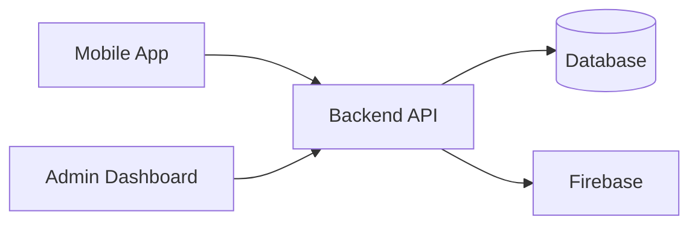
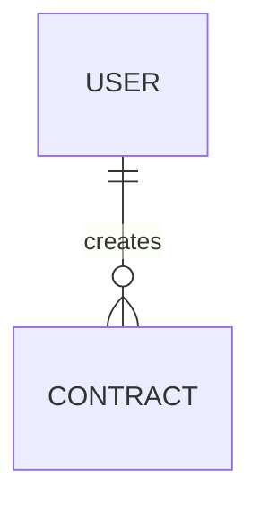

You are working with a complete software system split across 3 repositories:

1. Mobile application repository
2. Backend/API repository
3. Admin dashboard repository

Your task is to perform a deep technical audit of the entire system across all three repositories, then produce two Markdown files:

* `FIXES.md`
* `SYSTEM_DOCUMENTATION.md`

Do not make changes to the code unless explicitly asked later. This task is investigation, verification, analysis, and documentation only.

The repositories must be analyzed as one connected system, not as three isolated codebases.

## Core objective

Fully understand how the system works end-to-end, identify all defects, risks, inconsistencies, incomplete implementations, architectural problems, security issues, integration problems, dead code, maintainability problems, and potential user abuse cases.

Do not report speculative issues as facts.

Every reported issue must be backed by concrete evidence from the codebase whenever possible, including:

* repository
* file path
* relevant class/function/component/endpoint
* line number or approximate code location if available
* explanation of why it is an issue
* affected system components
* realistic impact
* recommended fix

If something cannot be verified from the code, explicitly mark it as:

`Needs verification`

Do not invent behavior, endpoints, requirements, entities, vulnerabilities, or flows.

---

# Execution strategy

This is a large task. Do not try to inspect everything in one context window.

Use subagents or equivalent isolated analysis tasks whenever available.

Divide the audit into independent workstreams such as:

* backend architecture and API audit
* mobile application audit
* admin dashboard audit
* authentication and authorization audit
* database/model/schema audit
* frontend/backend integration audit
* security audit
* secrets/configuration audit
* business logic audit
* concurrency/race condition audit
* networking/error handling audit
* file upload/storage audit
* notifications audit
* state management audit
* API contract consistency audit
* dependency audit
* deployment/configuration audit
* dead code and maintainability audit
* user abuse/threat modeling audit
* testing coverage audit
* complete system documentation reconstruction

Each subagent should return structured findings with evidence.

After each major phase, consolidate findings into a compact structured summary before continuing.

If the context becomes large, compact previous findings into a reliable internal summary before proceeding. Preserve exact file paths, endpoint names, entity names, and important evidence.

Do not discard unresolved findings during compaction.

Cross-check findings from different repositories before finalizing them.

For example, never conclude that a frontend API call is wrong without checking the corresponding backend route.

---

# Phase 1: Repository discovery

Start by examining all three repositories.

Build an internal map containing:

* directory structure
* frameworks
* languages
* package managers
* major dependencies
* entry points
* environment files
* configuration files
* routing
* state management
* API clients
* authentication system
* database technology
* ORM/ODM
* external services
* Firebase usage
* storage/file upload systems
* notification systems
* background jobs
* scheduled tasks
* WebSockets/realtime systems
* deployment configuration
* tests
* CI/CD
* logging
* monitoring

Identify the relationship between all three repositories.

Create a system map showing:

`Mobile App -> Backend -> Database / External Services`

`Admin Dashboard -> Backend -> Database / External Services`

and any direct external-service access performed by the frontends.

---

# Phase 2: Backend audit

Inspect the backend deeply.

Audit at minimum:

## API architecture

Check:

* routes
* controllers
* services
* middleware
* repositories
* models
* DTOs/schemas
* validators
* utility functions
* background workers
* scheduled jobs

Look for:

* duplicated logic
* inconsistent architecture
* route/controller mismatch
* missing validation
* malformed responses
* inconsistent status codes
* inconsistent response structures
* undocumented endpoints
* unused endpoints
* unreachable code
* broken route registration
* wrong HTTP methods
* incorrect parameter handling
* missing pagination
* incorrect filtering
* missing sort validation
* unsafe query construction

## Authentication

Audit:

* login
* registration
* logout
* token creation
* token verification
* refresh tokens
* session invalidation
* Firebase authentication if used
* role handling
* account deletion
* password reset
* email verification

Check for:

* missing authentication middleware
* token acceptance flaws
* weak token verification
* tokens that never expire
* insecure refresh token handling
* authorization depending only on frontend state
* account enumeration
* insecure password handling
* inconsistent identity mapping between Firebase and database users

## Authorization

Check every privileged endpoint.

Verify:

* user roles
* admin roles
* ownership checks
* resource access rules
* IDOR vulnerabilities
* privilege escalation
* users modifying other users' resources
* users deleting resources they do not own
* users accessing admin-only information
* admins being able to bypass intended restrictions unintentionally

## Validation

Check:

* request body validation
* path parameters
* query parameters
* enum validation
* dates
* numbers
* files
* URLs
* object IDs
* arrays
* nested objects

Identify any place where malformed input may crash the server or create invalid database state.

## Error handling

Check:

* unhandled promises
* missing try/catch where required
* swallowed errors
* errors exposing stack traces
* inconsistent error formats
* errors converted incorrectly
* database errors leaked to clients
* sensitive data logged

## Database

Audit:

* schemas
* models
* relations
* indexes
* uniqueness constraints
* required fields
* nullable fields
* defaults
* timestamps
* soft deletes
* cascading behavior
* transaction usage
* query efficiency

Look for:

* missing indexes
* duplicate data risks
* inconsistent relations
* orphan records
* N+1 queries
* race conditions
* unsafe read-modify-write patterns
* partial writes
* operations requiring transactions but not using them
* inconsistent timestamps
* incorrect schema assumptions between repositories

## Concurrency and race conditions

Search specifically for:

* duplicate requests
* double payments
* repeated submissions
* duplicate notifications
* simultaneous updates
* counters
* balances
* booking/reservation logic
* contract acceptance
* dispute handling
* status transitions
* file processing
* reward systems
* invite flows
* uniqueness checks performed before insertion without atomic enforcement

Identify TOCTOU issues and missing atomic operations.

## Security

Check for:

* SQL/NoSQL injection
* command injection
* XSS
* SSRF
* CSRF where relevant
* insecure CORS
* path traversal
* arbitrary file upload
* MIME spoofing
* malicious filenames
* unsafe deserialization
* prototype pollution
* ReDoS
* insecure redirects
* insufficient rate limiting
* brute-force vulnerabilities
* denial-of-service vectors
* sensitive information disclosure
* broken access control
* insecure cryptography
* weak random values
* predictable IDs
* mass assignment
* excessive data exposure

## Secrets

Search for:

* API keys
* Firebase credentials
* service account keys
* JWT secrets
* database credentials
* MongoDB URIs
* private keys
* passwords
* tokens
* cloud credentials
* SMTP credentials
* hardcoded secrets

Inspect:

* source files
* environment files
* config files
* test files
* scripts
* Docker files
* CI/CD files
* Git-related configuration

Distinguish between:

* actual secret
* placeholder
* public client key
* false positive

Do not expose complete secret values in the report. Mask them.

---

# Phase 3: Mobile application audit

Inspect the complete mobile application.

Audit:

* navigation
* screens
* state management
* repositories/services
* API client
* authentication
* token persistence
* caching
* local storage
* forms
* validation
* file uploads
* notifications
* realtime features
* deep links
* localization
* permissions
* error states
* loading states
* offline behavior

Check for:

* broken screens
* unreachable screens
* incorrect navigation
* stale state
* duplicated requests
* infinite rebuild/refetch loops
* memory leaks
* lifecycle misuse
* race conditions
* missing disposal
* unsafe async UI updates
* null crashes
* force unwraps
* incorrect state restoration
* inconsistent loading states
* hidden API failures
* frontend validation that disagrees with backend validation
* hardcoded URLs
* hardcoded IDs
* hardcoded user values
* environment-specific logic
* dev/prod configuration leaks
* incorrect API base URL
* direct production dependencies in development
* debug-only code left enabled
* mocked data remaining in production code
* TODO/FIXME items affecting behavior
* inaccessible or misleading UI

If Flutter is used, inspect specifically:

* providers
* Riverpod/Bloc/Provider state lifecycles
* FutureBuilder/StreamBuilder misuse
* BuildContext across async gaps
* controllers
* focus nodes
* animation controllers
* subscriptions
* mounted checks
* widget rebuild behavior
* dependency injection
* Dio/http interceptors
* retry logic
* token refresh logic
* caching logic

---

# Phase 4: Admin dashboard audit

Perform the same level of audit for the admin dashboard.

Additionally check:

* frontend-only authorization
* admin routes accessible without backend authorization
* hidden UI being treated as security
* unsafe admin actions
* insufficient confirmation for destructive actions
* missing audit logs
* sensitive user data exposure
* over-fetching
* bulk operations
* filtering/search issues
* inconsistent pagination
* stale dashboard data
* incorrect counters/statistics
* broken role assumptions
* hardcoded admin accounts
* dev backdoors
* dangerous debug tools

---

# Phase 5: Cross-repository API contract audit

This is one of the most important phases.

Build a complete endpoint matrix.

For every frontend call from both mobile and admin dashboard, record:

* HTTP method
* endpoint
* request parameters
* request body
* authentication requirements
* expected response
* frontend caller
* backend implementation

Then compare them.

Find:

* endpoints called by frontend but missing from backend
* backend endpoints never used
* incorrect HTTP methods
* wrong paths
* incorrect parameter names
* incorrect request fields
* incorrect response assumptions
* type mismatches
* enum mismatches
* inconsistent IDs
* missing fields
* renamed fields
* inconsistent date formats
* incorrect status handling
* backend returning data frontend ignores
* frontend expecting data backend never returns

Also inspect versioned routes such as:

`/api/v1/...`

versus:

`/v1/...`

or environment-dependent URLs.

---

# Phase 6: Data model consistency audit

Compare:

* backend database models
* frontend DTOs/models
* admin dashboard interfaces/types
* API serialization
* database fields

Look for:

* naming mismatches
* missing fields
* outdated models
* nullable mismatch
* enum mismatch
* integer/string ID mismatch
* incorrect nested structures
* inconsistent date parsing
* inconsistent status naming
* backend fields not represented in frontend
* frontend fields that do not exist in backend

Create a model consistency matrix internally.

---

# Phase 7: Configuration and environment audit

Inspect:

* `.env`
* `.env.example`
* configuration modules
* constants
* build flavors
* deployment variables
* API URLs
* Firebase setup
* storage endpoints
* CORS configuration
* allowed origins
* feature flags

Look for:

* localhost references
* development URLs
* production URLs hardcoded in source
* duplicate environment systems
* inconsistent variable names
* missing required environment validation
* environment variables silently defaulting to unsafe values
* development credentials being used in production
* production credentials in source
* conflicting configuration between repositories

---

# Phase 8: User abuse and threat modeling

Analyze how a malicious or abnormal user could misuse the system.

Do not only look for conventional vulnerabilities.

Consider abuse such as:

* spam
* mass account creation
* brute-force attempts
* repeated submissions
* duplicate contracts
* fake disputes
* excessive file uploads
* storage exhaustion
* notification spam
* API flooding
* scraping
* enumeration
* manipulating status transitions
* replaying requests
* bypassing client-side limitations
* modifying request payloads manually
* impersonating another user
* tampering with IDs
* sending oversized payloads
* invalid file types
* malformed images
* deleting resources in unexpected order
* conflicting simultaneous actions
* intentionally causing inconsistent state
* abusing reward/credit systems
* abusing invitation systems
* exploiting missing rate limits

For each realistic abuse scenario, verify whether backend protections exist.

---

# Phase 9: Code quality and maintainability audit

Search for:

* dead code
* duplicate code
* unused imports
* unused functions
* unused components
* abandoned screens
* commented-out production code
* large functions
* god classes
* circular dependencies
* inconsistent naming
* excessive coupling
* hardcoded constants
* magic numbers
* magic strings
* duplicate configuration
* poor separation of concerns
* business logic inside UI
* database logic inside route handlers
* multiple implementations of the same behavior
* deprecated APIs
* obsolete dependencies
* TODO
* FIXME
* HACK
* temporary code
* debug logs
* console logs
* print statements
* disabled lint rules
* ignored type errors
* `any` abuse where relevant
* forced casts
* unsafe null handling

Separate purely stylistic issues from issues that affect maintainability or correctness.

Do not flood `FIXES.md` with trivial formatting observations.

---

# Phase 10: Dependency audit

Inspect dependency manifests and lockfiles.

Identify:

* unused dependencies
* duplicate libraries performing the same function
* deprecated packages
* suspicious packages
* packages with known serious vulnerabilities if verifiable from available tooling
* incompatible versions
* outdated integrations
* unnecessary SDKs
* development packages included in production

Do not invent CVEs.

Only report dependency vulnerabilities when they can be verified.

---

# Phase 11: Logging, observability and production readiness

Check:

* structured logging
* request IDs
* error tracking
* audit logging
* admin action logs
* crash reporting
* monitoring
* health endpoints
* startup validation
* graceful shutdown
* retry behavior
* timeout configuration
* database connection handling
* external service failure handling

Identify production failure scenarios.

---

# Phase 12: Testing audit

Inspect existing tests.

Determine:

* unit test coverage areas
* integration tests
* API tests
* UI/widget tests
* end-to-end tests
* security tests

Identify critical flows that lack tests.

Especially verify coverage for:

* authentication
* authorization
* account lifecycle
* core business workflows
* admin actions
* status transitions
* database consistency
* error scenarios
* concurrency
* retries
* malformed requests

Do not fabricate coverage percentages unless actual coverage reports exist.

---

# `FIXES.md`

Create a Markdown file named exactly:

`FIXES.md`

Start with:

# Full System Audit Report

Include:

## Executive Summary

Summarize:

* overall system condition
* highest-risk findings
* major integration problems
* major security concerns
* major reliability concerns
* major maintainability concerns

Do not provide unsupported scoring.

---

## Priority Classification

Use:

### Critical

Issues that can cause:

* serious security compromise
* unauthorized data access
* credential exposure
* irreversible data corruption
* major authentication/authorization bypass
* production-wide failure

### High

Issues likely to cause:

* broken core functionality
* inconsistent data
* exploitable abuse
* significant production failures
* broken frontend/backend integration

### Medium

Issues affecting:

* reliability
* maintainability
* performance
* error handling
* partial functionality

### Low

Issues involving:

* cleanup
* dead code
* minor technical debt
* small UX inconsistencies
* non-critical refactors

---

For every issue use this structure:

## [ID] Short Issue Title

**Severity:** Critical / High / Medium / Low

**Category:** Security / Backend / Mobile / Admin / Database / Integration / Configuration / Performance / Code Quality / Testing / etc.

**Affected repositories:**

* repo name

**Location:**

* `path/to/file`
* relevant function/class/endpoint

**Problem:**

Precise explanation.

**Evidence:**

Concrete evidence from the repository.

**Impact:**

What can realistically happen.

**Reproduction / Failure Scenario:**

Explain how the issue manifests if applicable.

**Recommended Fix:**

Concrete remediation.

**Related Issues:**

Reference IDs if applicable.

---

Group findings under sections such as:

* Critical Issues
* Security
* Authentication and Authorization
* Backend
* Mobile Application
* Admin Dashboard
* Frontend/Backend Integration
* Database
* Race Conditions and Concurrency
* Configuration and Environment
* Secrets and Credentials
* User Abuse and Threat Model
* Performance
* Error Handling
* Dead Code and Cleanup
* Architecture
* Testing
* Deployment and Production Readiness

At the end include:

## Unused or Dead Code Candidates

## Hardcoded Values

## TODO / FIXME / HACK Inventory

## Unused Backend Endpoints

## Missing Backend Endpoints Referenced by Frontends

## API Contract Mismatches

## Data Model Mismatches

## Missing Validation

## Missing Authorization Checks

## Missing Rate Limits

## Race Condition Candidates

## Potential User Abuse Cases

## Production Configuration Risks

## Recommended Fix Order

Give an ordered remediation plan based on dependencies and severity.

Do not duplicate the same underlying issue multiple times. Cross-reference related findings.

---

# `SYSTEM_DOCUMENTATION.md`

Create a second Markdown file named exactly:

`SYSTEM_DOCUMENTATION.md`

This must describe the actual existing system reconstructed from the repositories.

Do not document imagined or planned features as existing features.

If functionality appears unfinished, explicitly mark it as incomplete.

Use the following structure.

# System Documentation

## 1. System Overview

Explain:

* application idea
* main problem it solves
* objectives
* target users
* major system components

---

## 2. System Scope

Define:

* included functionality
* system boundaries
* external integrations
* responsibilities of mobile app
* responsibilities of backend
* responsibilities of admin dashboard

---

## 3. Actors and User Roles

Document every verified role.

Examples may include:

* visitor
* authenticated user
* administrator

Do not include roles not present in code.

For each role explain permissions.

---

## 4. Functional Requirements

Derive functional requirements from actual implemented behavior.

Use IDs such as:

`FR-001`

For example:

`FR-001: The system shall allow ...`

Each requirement should reference the corresponding implemented feature internally during analysis.

---

## 5. Non-Functional Requirements

Document verified or logically necessary system characteristics such as:

* security
* availability
* performance
* scalability
* maintainability
* usability
* compatibility
* reliability
* privacy

Clearly distinguish between:

* implemented behavior
* inferred architectural requirement
* missing requirement

---

## 6. System Architecture

Explain:

* high-level architecture
* frontend applications
* backend
* database
* external services
* authentication provider
* file storage
* notification infrastructure

Include a Mermaid architecture diagram.

Example style:

But generate the actual diagram based on the repositories.

---

## 7. Repository Structure

Explain each repository separately.

### Mobile Application

* architecture
* important directories
* important modules
* state management
* networking
* navigation

### Backend

* architecture
* routes
* controllers
* services
* database
* middleware

### Admin Dashboard

* architecture
* routing
* API access
* state management
* major views

---

## 8. Technology Stack

Create a table:

| Layer | Technology | Purpose |
| ----- | ---------- | ------- |

Only include technologies verified in the repositories.

---

## 9. Database Design

Explain:

* database technology
* entities
* relationships
* important constraints
* indexes if relevant

Create an ERD using Mermaid when possible.

Example:

Use the actual models.

---

## 10. Data Dictionary

For each major entity document:

* field
* type
* required/optional
* purpose
* relationships
* constraints

Do not expose secret values.

---

## 11. API Documentation

Document every meaningful backend endpoint.

Use a table:

| Method | Endpoint | Authentication | Role | Purpose |
| ------ | -------- | -------------- | ---- | ------- |

Then document important endpoints in detail:

* request
* parameters
* response
* error behavior
* calling frontend

Do not fabricate examples that conflict with implementation.

---

## 12. Authentication and Authorization

Explain the complete authentication flow.

Include:

* login
* registration
* token handling
* Firebase if used
* backend verification
* authorization
* role checks
* session lifecycle

Create a Mermaid sequence diagram.

---

## 13. Main System Workflows

Document each major user workflow.

For each workflow include:

* actor
* preconditions
* steps
* backend interaction
* database effects
* result
* failure cases

Examples should come from actual system features.

---

## 14. Use Case Diagram

Generate a Mermaid-compatible representation when possible.

If Mermaid does not support the desired UML format well, use a clear flowchart representation.

Include only verified use cases.

---

## 15. Activity Diagrams

Create activity diagrams for major workflows.

Use Mermaid.

---

## 16. Sequence Diagrams

Create sequence diagrams for important flows involving:

* user
* frontend
* backend
* database
* external services

Use actual endpoint behavior.

---

## 17. Class / Domain Model Diagram

Build a useful class or domain model based on backend models and major application abstractions.

Use Mermaid.

Do not create meaningless diagrams from every code class.

---

## 18. UI/UX Documentation

Describe the actual application interfaces.

For the mobile application:

* navigation structure
* main screens
* forms
* important user actions
* loading/error states

For the admin dashboard:

* main sections
* management features
* administrative flows

Do not claim a visual feature unless it exists.

---

## 19. Frontend-to-Backend Integration

Explain:

* API client structure
* authentication headers
* request flow
* serialization
* error handling
* frontend models
* backend response models

Document known inconsistencies separately.

---

## 20. External Integrations

Document all verified integrations, such as:

* Firebase
* email
* push notifications
* cloud storage
* third-party APIs

Explain what each integration does.

Do not expose credentials.

---

## 21. Implementation Details

Explain important implementation decisions including:

* state management
* service layer
* repository pattern
* middleware
* validation
* caching
* background tasks
* asynchronous operations
* file handling
* notification handling

---

## 22. Security Design

Document:

* authentication
* authorization
* validation
* rate limiting
* secret management
* data protection
* file security
* transport security assumptions

Separate implemented protections from missing protections.

---

## 23. Error Handling

Explain how errors propagate through:

* mobile application
* backend
* admin dashboard

Document common error response structures.

---

## 24. Testing

Document existing tests.

Include:

* test framework
* unit tests
* integration tests
* end-to-end tests
* tested workflows

Then include:

### Missing Critical Tests

Only list gaps verified from the repository.

---

## 25. Deployment

Document current deployment-related configuration found in the repositories.

Include:

* environment variables
* build configuration
* backend hosting
* frontend hosting
* mobile environment configuration
* database configuration

Do not guess deployment providers unless configuration proves them.

---

## 26. System Limitations

Document verified limitations and incomplete functionality.

Cross-reference relevant IDs from `FIXES.md`.

---

## 27. Future Work

Derive future work from:

* incomplete code
* TODOs
* architectural limitations
* missing tests
* scalability constraints
* known defects

Clearly label this section as recommendations, not existing features.

---

## 28. Conclusion

Summarize:

* what the system currently implements
* architecture
* major strengths
* major limitations

Keep it factual.

---

## 29. References

Use references such as:

* official documentation of frameworks used
* official API documentation for external services
* repository documentation
* relevant standards

Do not invent academic references.

---

# Diagram requirements

Use Mermaid diagrams directly inside `SYSTEM_DOCUMENTATION.md`.

Generate at minimum, when supported by the code:

* system architecture diagram
* ERD
* authentication sequence diagram
* at least one major workflow sequence diagram
* at least one activity diagram
* use case representation
* domain/class diagram

Every diagram must reflect the actual implementation.

---

# Evidence requirements

Before reporting an issue:

1. Find the relevant code.
2. Inspect surrounding implementation.
3. Check whether another layer already handles the concern.
4. Check related backend/frontend implementation.
5. Determine whether it is genuinely reachable.
6. Determine whether it is production code or test/mock/dead code.
7. Only then report it.

For security findings, avoid false positives.

Example:

Do not report "endpoint has no authorization" merely because the controller has no role check if a route-level middleware already enforces it.

Do not report leaked credentials if the value is clearly a placeholder.

Do not report missing validation on the frontend as a security vulnerability if the backend validates correctly. It may still be a UX issue.

---

# Cross-validation pass

After the initial audit, perform a second pass specifically to challenge your own findings.

For every Critical and High severity issue:

* re-open the relevant files
* verify the call path
* verify middleware
* verify configuration
* verify frontend/backend assumptions
* verify that the issue is actually reachable

Downgrade or remove false positives.

Then perform a second integration pass:

* mobile -> backend
* admin -> backend
* backend -> database
* backend -> external services

Look for contradictions that individual repository audits may have missed.

---

# Final consistency checks

Before finishing:

* confirm both files exist
* confirm file names are exactly:

  * `FIXES.md`
  * `SYSTEM_DOCUMENTATION.md`
* ensure no credentials are exposed
* ensure no finding is fabricated
* ensure Critical/High findings contain evidence
* ensure endpoint names match the source
* ensure entity names match the source
* ensure diagrams match the implementation
* ensure incomplete features are labeled as incomplete
* ensure recommendations are not presented as existing behavior
* remove duplicate issues
* verify Markdown formatting
* verify Mermaid syntax as much as possible

Do not stop after inspecting only obvious files.

Perform repository-wide searches for important patterns including:

`TODO`
`FIXME`
`HACK`
`localhost`
`127.0.0.1`
`http://`
`https://`
`password`
`secret`
`token`
`apiKey`
`private_key`
`client_email`
`MONGO_URI`
`DATABASE_URL`
`JWT`
`Firebase`
`console.log`
`print(`
`debug`
`admin`
`role`
`authorization`
`middleware`
`upload`
`delete`
`update`
`status`

Also search for environment-variable usage and compare it against environment examples/configuration.

The final result must be a forensic-quality audit and a complete technical description of the existing system, not a superficial code review.
